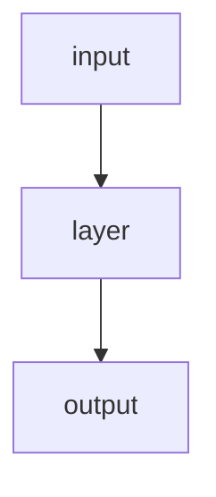

# Documentation Practices

This file describes conventions for writing files inside `docs/`. Read it before creating or editing any documentation.

## Audience

All documentation in `docs/` targets **Python-proficient readers who are new to LLMs and model architectures**. Assume:

- Comfortable with Python classes, functions, and data structures
- Familiar with the idea of training a model but not the mechanics
- No assumed background in linear algebra, calculus, or ML theory
- Will be reading alongside a live demo — brevity matters

Do **not** assume:
- Prior exposure to PyTorch
- Knowledge of terms like "logits", "softmax", "embedding", "attention" — define them on first use
- Familiarity with academic ML papers

## Document Structure

Every file in `docs/` MUST follow this structure:

```
# Title

## TLDR

One to three paragraphs. What is this? Why does it matter? Where does it sit
relative to the other things in the project? A reader who stops here MUST come
away with a usable mental model.

---

## Detailed sections

(Two or more sections with depth.)
```

The TLDR must be self-contained. Do not assume the reader will scroll further.

Detailed sections can go as deep as needed, but prefer concrete examples and diagrams over prose.

## Tone and Terminology

- Use plain English. Avoid jargon where a plain word works.
- Define technical terms on first use with a short inline explanation: *logits (raw, unnormalised scores)*.
- Use analogies freely — an analogy that is slightly imprecise beats a precise definition the reader skips.
- Write in the present tense. "The model predicts...", not "The model will predict...".
- Avoid hedging ("roughly", "kind of", "sort of") — just say what the thing does.

## Diagrams

Prefer diagrams in this order: **Mermaid → ASCII → SVG**.

### 1. Mermaid (preferred)

Use Mermaid for any data flow, forward-pass pipeline, stage graph, or architecture diagram that has boxes and arrows. Mermaid renders natively in GitHub and most Markdown viewers, requires no separate files, and is easy to edit.

````markdown

````

Use `flowchart TD` (top-down) for forward passes and pipelines. Use `flowchart LR` (left-right) for sequential flows.

**Do not use Mermaid for:** matrix/grid visualisations, attention weight tables, pseudocode with complex inline shapes, or anything where the diagram *is* the data (e.g. a table of embedding vectors). Use ASCII for those.

### 2. ASCII (second choice)

Use ASCII for matrix layouts, grids, inline pseudocode-style diagrams, and anything Mermaid would render awkwardly. Put diagrams inline, close to the prose that explains them.

```
         key positions →
         0    1    2
q  0  [ 1.0  0.0  0.0 ]
u  1  [ 0.3  0.7  0.0 ]
```

### 3. SVG (last resort)

Use SVG only when Mermaid and ASCII both fail — typically when precise spatial layout or colour coding is essential and the diagram has many components.

```markdown

```

SVG files live in the same directory as the markdown that references them (e.g. `docs/architectures/transformer-block.svg` alongside `transformer.md`).

Guidelines for SVG diagrams:
- Use a monospace font for labels to match the code aesthetic
- Use soft, distinct colours — not too saturated
- Include a title element
- Keep the viewBox tight; avoid excessive whitespace

## File Placement

| Content type                    | Location                       |
| ------------------------------- | ------------------------------ |
| Architecture explainers         | `docs/architectures/<name>.md` |
| SVG assets for a doc            | Same directory as the markdown |
| Demo scripts / instructor notes | `docs/`                        |

Do not put implementation notes, task lists, or agent instructions inside `docs/`. Those belong in `agents/` or `openspec/`.
