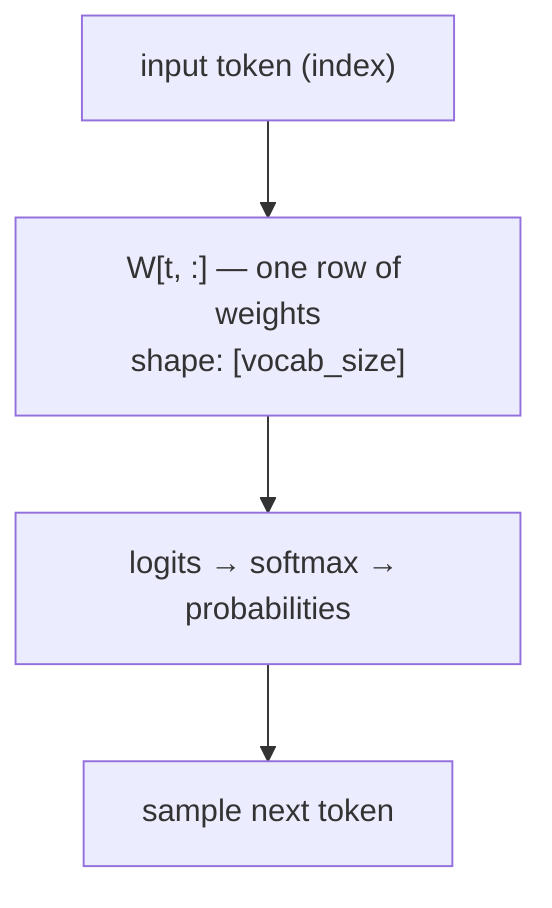
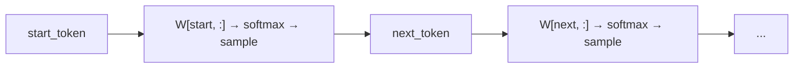

# Bigram Model

## TLDR

A bigram model predicts the next token using only the current token — nothing else. It learns a table of probabilities: given token A, how often does token B follow? That's the entire model.

It cannot learn context ("the word *bank* means something different after *river*"), cannot remember what happened two steps ago, and produces output that feels shuffled rather than structured. But it is trainable, inspectable with your eyes, and a genuine neural network — making it the perfect first model to understand before adding complexity.

---

## How it works

### The core idea

Given a token `t` at position `i`, predict the next token `t+1` by looking at a weight matrix `W` of shape `[vocab_size, vocab_size]`:



Each row `W[t, :]` holds the unnormalised log-probabilities (logits) for what comes after token `t`. There are no hidden layers, no embeddings beyond the index itself.

### Training

The model is trained with cross-entropy loss:

```
loss = -log P(correct_next_token | current_token)
```

In PyTorch this is just `F.cross_entropy(logits, targets)`. Gradient descent adjusts `W` so that rows corresponding to common predecessors assign higher probability to common successors.

After training on a names corpus, `W["a", :]` will have high weight on vowels and common following characters, because those pairs appeared often.

### Generation



Each step depends only on the previous token. Generated names look plausible letter-by-letter but lack longer-range structure (e.g. double letters, common English endings) because the model never sees further back.

---

## Key hyperparameters

| Parameter     | What it controls                                      |
| ------------- | ----------------------------------------------------- |
| `vocab_size`  | Size of `W` — set automatically from the tokenizer    |
| `temperature` | Sharpness of sampling distribution at generation time |

Temperature is not a trained parameter. At generation: `probs = softmax(logits / temperature)`. Low temperature → greedy / peaked; high temperature → more random.

There are no other hyperparameters. The bigram has no hidden size, no context length, no depth.

---

## What it can and cannot learn

**Can learn:**
- Which characters commonly follow which (e.g. `q` → `u`)
- Start/end patterns (what characters begin or end names)
- Rough character frequency

**Cannot learn:**
- Any context beyond the immediately preceding token
- Patterns that span more than two characters
- Word-level structure (e.g. common suffixes like `-ton`, `-ley`)

---

## Relation to Trigram and MLP

The natural next step from bigram is the **trigram**: same lookup-table mechanism, but using the last *two* tokens (`W[t_{n-1}, t_n, :]` from a V×V×V tensor). The trigram captures two-character onset and coda patterns that the bigram misses entirely. It is practical only for small character-level vocabularies — the weight tensor grows as V³.

The **MLP** (next planned architecture) extends both by:
1. Looking at a *window* of `k` recent tokens instead of just one or two
2. Mapping each token to a learned *embedding vector* instead of using raw indices
3. Passing those embeddings through a hidden layer before predicting

The bigram is equivalent to an MLP with `k=1` and no hidden layer. The trigram sits between them — more context than bigram, but still a direct lookup rather than learned embeddings.
