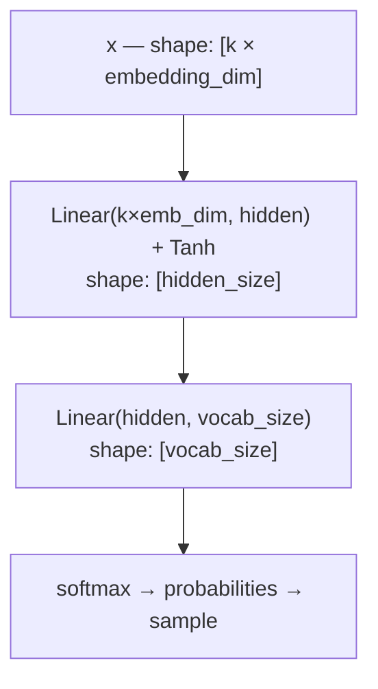

# MLP (Multilayer Perceptron)

## TLDR

The MLP extends the bigram by giving the model a memory of the last `k` tokens (a *context window*) and representing each token as a learned vector (an *embedding*) rather than a raw index. This lets it notice patterns like "names often end in a vowel after a consonant cluster" — something a bigram can never see.

The architecture is due to [Bengio et al., 2003](https://jmlr.org/papers/v3/bengio03a.html) and remains one of the clearest illustrations of what embeddings and hidden layers buy you.

---

## How it works

### Embeddings

Each token in the vocabulary gets a trainable embedding vector of size `embedding_dim`. Instead of a one-hot index, the model works with a dense real-valued representation:

```
vocabulary:  [ 'a',  'b',  'c', ... ]
                │     │     │
embeddings:  [0.3,  0.1, -0.2, ...]   ← each is a vector of size embedding_dim
             [0.9, -0.4,  0.7, ...]
             [-0.1, 0.2,  0.5, ...]
```

Initially random, these vectors are learned during training. Tokens that appear in similar contexts will tend to end up with similar vectors. This is the origin of the idea that embeddings "capture meaning."

### Context window

The model looks at the last `context_length` tokens at each prediction step. Their embeddings are concatenated into a single flat input vector:

```
context = [t_{i-k}, t_{i-k+1}, ..., t_{i-1}]   (k = context_length)

embed each:
  e_1 = E[t_{i-k}]    shape: [embedding_dim]
  e_2 = E[t_{i-k+1}]  shape: [embedding_dim]
  ...
  e_k = E[t_{i-1}]    shape: [embedding_dim]

concatenate → x          shape: [k * embedding_dim]
```

### Forward pass



The hidden layer is what lets the model learn non-linear combinations of the context — things like "a vowel in the second-to-last position *and* a consonant in the last position suggests a vowel is coming."

### Training

Same cross-entropy loss as the bigram, but now over windows of tokens:

```
for each position i in the corpus:
    context = tokens[i - k : i]       # k preceding tokens
    target  = tokens[i]               # next token
    logits  = forward(context)
    loss   += cross_entropy(logits, target)
```

---

## Key hyperparameters

| Parameter        | What it controls                                             |
| ---------------- | ------------------------------------------------------------ |
| `embedding_dim`  | Size of each token's vector — larger = more expressive       |
| `context_length` | How many preceding tokens the model sees — the "memory"      |
| `hidden_size`    | Width of the hidden layer — capacity for non-linear patterns |

Typical small values for a names demo: `embedding_dim=32`, `context_length=8`, `hidden_size=128`.

---

## What it can and cannot learn

**Can learn:**
- Patterns spanning up to `context_length` tokens
- Non-linear combinations of context (via the hidden layer)
- Token similarity through embeddings (similar tokens cluster together)
- Common suffixes, prefixes, typical name lengths

**Cannot learn:**
- Patterns longer than `context_length`
- Which part of the context matters for this prediction — all positions are treated equally (this is what attention fixes)
- Long-range dependencies (e.g. rhyme or repetition across a whole name)

---

## Relation to bigram and transformer

The MLP is the bigram with two additions: a context window and a hidden layer.

The transformer (next) keeps the context window and the embeddings but replaces the "concatenate all positions and feed through MLP" with *attention* — a mechanism that lets the model selectively focus on the positions in the context that are most relevant for each prediction, rather than treating all positions equally.

```
Bigram:      W[t]                   → logits
MLP:         concat(E[t-k..t-1])    → hidden → logits
Transformer: attend(E[t-k..t-1])    → hidden → logits
```
