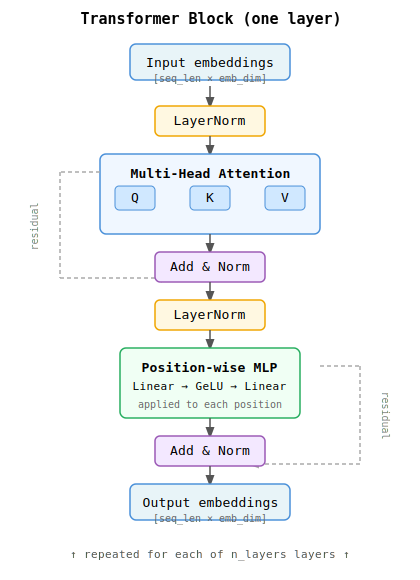

# Transformer

## TLDR

The transformer replaces the MLP's "concatenate everything and hope" approach with *attention*: a learned mechanism for deciding which positions in the context are relevant for predicting the next token. Instead of treating all positions equally, each position can ask "which other positions should I pay attention to?" and get a weighted answer.

This makes transformers dramatically more capable than MLPs at the same context length — they can learn that "the token four steps ago matters a lot here, the token two steps ago barely at all." It is the architecture behind GPT, BERT, and essentially every large language model today.

---

## How it works

### The residual stream

The transformer processes a sequence of token embeddings through a series of layers. Each layer adds its output to its input rather than replacing it — this is the *residual connection*. See the diagram below for the full block structure.



```
input embeddings
      │
      ▼
  ┌───────────────┐
  │  Attention    │──── adds to stream
  └───────────────┘
      │
      ▼
  ┌───────────────┐
  │  MLP block    │──── adds to stream
  └───────────────┘
      │
      ▼
  (repeat for each layer)
      │
      ▼
  final linear → logits
```

The residual connection means early layers do not have to solve everything — later layers can refine the representation incrementally.

### Self-attention

This is the key mechanism. For each position `i`, attention computes a weighted sum of the values at all preceding positions, where the weights are determined by how "relevant" each position is.

Each token's embedding is projected into three vectors:

- **Query (Q)**: "What am I looking for?"
- **Key (K)**: "What do I advertise about myself?"
- **Value (V)**: "What information do I carry?"

```
for position i:
    Q_i = embedding_i @ W_Q    ← what i is looking for
    K_j = embedding_j @ W_K    ← what j offers (for all j ≤ i)
    V_j = embedding_j @ W_V    ← what j contributes

    score(i, j) = Q_i · K_j / sqrt(head_dim)
    weight(i, j) = softmax(scores)[j]          ← how much to attend to j

    output_i = Σ_j weight(i, j) * V_j          ← weighted sum of values
```

Visualised as a matrix (each row = one query position, each column = one key position):

```
         key positions →
         0    1    2    3
q  0  [ 1.0  0.0  0.0  0.0 ]   ← position 0 can only see itself
u  1  [ 0.3  0.7  0.0  0.0 ]   ← position 1 attends to 0 and 1
e  2  [ 0.1  0.4  0.5  0.0 ]   ← position 2 attends to 0, 1, 2
r  3  [ 0.2  0.1  0.3  0.4 ]   ← position 3 attends to all so far
↓
```

The zeros in the upper triangle enforce *causal masking*: position `i` cannot look at future positions. This is what makes the model usable for generation (you never peek at what you're trying to predict).

### Multi-head attention

Rather than a single attention computation, the transformer runs `n_heads` attention operations in parallel, each with its own Q/K/V projection matrices. Their outputs are concatenated:

```
head_1: attends to short-range patterns
head_2: attends to long-range dependencies
head_3: attends to specific token types
...

concat(head_1, ..., head_n) → linear → output
```

In practice the heads specialise automatically during training — you don't choose what each head looks for.

### MLP block

After attention, each position passes through a small position-wise MLP (applied identically to each position independently). This adds non-linear capacity beyond what attention provides:

```
for each position i independently:
    h = GeLU(embedding_i @ W_1 + b_1)
    output_i = h @ W_2 + b_2
```

### Positional encoding

Unlike the MLP (which concatenates embeddings in order), attention is *order-agnostic* — the same set of tokens in a different order would produce the same attention weights. Positional encodings inject position information by adding a position-dependent vector to each token's embedding:

```
input to transformer = token_embedding + positional_embedding
```

The positional embeddings are learned parameters (one vector per position, up to `context_length`).

---

## Key hyperparameters

| Parameter        | What it controls                                                    |
|------------------|---------------------------------------------------------------------|
| `embedding_dim`  | Size of the residual stream — all projections work in this space    |
| `context_length` | Maximum sequence length the model can attend over                   |
| `n_layers`       | Depth — how many attention+MLP blocks are stacked                   |
| `n_heads`        | Number of parallel attention heads — more heads = finer patterns    |
| `dropout`        | Regularisation — fraction of activations zeroed during training     |

Typical small values for a CPU-friendly demo: `embedding_dim=64`, `context_length=32`, `n_layers=2`, `n_heads=2`.

---

## What it can and cannot learn

**Can learn:**
- Which positions in the context are relevant for each prediction, dynamically per token
- Different patterns at different heads (short-range vs long-range, structural vs semantic)
- Long-range dependencies up to `context_length` tokens
- Rich compositionality through stacked layers

**Cannot learn:**
- Patterns longer than `context_length` (without extensions like sliding window attention)
- Recurrent state — each forward pass is independent; there is no persistent hidden state between calls

---

## Relation to MLP

Both the MLP and transformer take a context window of embeddings and produce logits. The difference is how they combine the context:

```
MLP:         concat all positions → dense hidden → logits
             (all positions contribute equally, non-linearly combined)

Transformer: attend selectively → position-wise MLP → logits
             (positions contribute in proportion to learned relevance)
```

The transformer's attention mechanism allows it to "zoom in" on the relevant part of the context rather than processing everything with equal weight. This is why transformers generalise much better than MLPs at longer context lengths.
