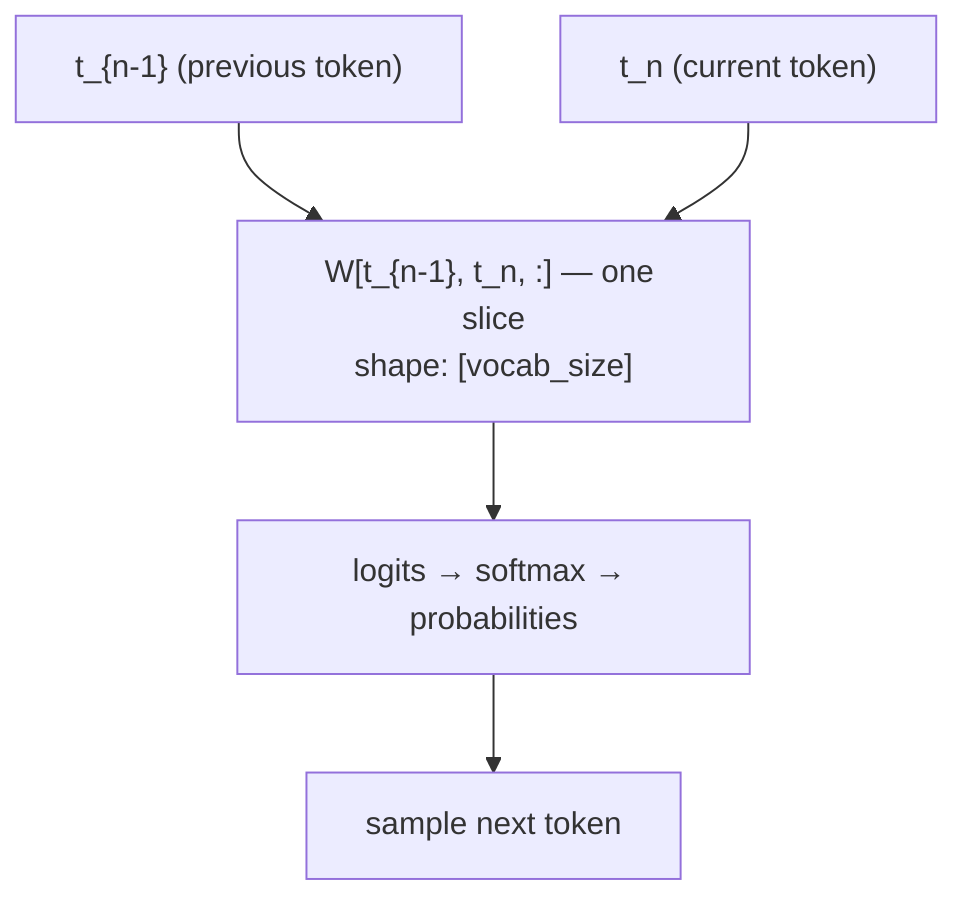

# Trigram Model

## TLDR

A trigram model predicts the next token using the **last two tokens** — one step further than the bigram's single-token context. It learns a three-dimensional table: given tokens A and B, how often does token C follow? That's the entire model.

It captures two-character patterns (common onsets like "br", "th"; common endings like "-on", "-ey") that the bigram completely misses. It still cannot look further back, learn word-level structure, or generalise across positions — but it is a meaningful improvement over bigram at negligible implementation cost.

---

## How it works

### The core idea

Given the last two tokens `t_{n-1}` and `t_n`, predict token `t_{n+1}` by looking up a weight tensor `W` of shape `[V, V, V]`:



Each slice `W[a, b, :]` holds the unnormalised log-probabilities for what follows the pair `(a, b)`. There are no hidden layers, no embeddings — just a three-index table lookup.

### Training

Training is identical to the bigram, with `context_length = 2`. The training stage assembles input batches of shape `(batch_size, 2)` and passes them to the model. Cross-entropy loss adjusts `W` so that slices corresponding to common pairs assign higher probability to their common successors.

After training on a names corpus, `W["t", "h", :]` will have high weight on `"e"` and `"i"` because those triples appear often.

### Generation

At each step, the last two tokens are looked up:

```
token_ids[-2:] → W[t_{n-1}, t_n, :] → softmax → sample → next token
```

**Cold-start**: on the very first generation step (when the prompt is only one character), `_generate` prepends the `\n` token to reach the required context length of 2. Since `W["\n", t]` was trained on every name beginning with character `t`, this gives a reasonable first distribution. From the second step onward, predictions are fully trigram.

---

## Key hyperparameters

| Parameter     | What it controls                                      |
| ------------- | ----------------------------------------------------- |
| `vocab_size`  | Size of `W` — set automatically from the tokenizer    |
| `temperature` | Sharpness of sampling distribution at generation time |

There are no other hyperparameters. Like the bigram, the trigram has no hidden size, no depth, and no positional information beyond the two-token window.

---

## What it can and cannot learn

**Can learn:**
- Two-character sequences (bigrams in the linguistic sense: "th", "br", "on", "ey")
- Onset and coda patterns common in names
- Which characters commonly end names after specific two-character sequences

**Cannot learn:**
- Any context beyond the two immediately preceding tokens
- Patterns spanning more than three characters
- Word-level structure, morphology, or semantics

---

## The V³ scaling limitation

The trigram weight tensor has `V³` parameters — **cubed** vocabulary size:

| Vocabulary        | Bigram (V²) | Trigram (V³)  |
| ----------------- | ----------- | ------------- |
| Char (V ≈ 27)     | 729         | 19,683        |
| Char (V ≈ 70)     | 4,900       | 343,000       |
| BPE (V = 256)     | 65,536      | 16,777,216    |
| BPE (V = 1,000)   | 1,000,000   | 1,000,000,000 |

The trigram is practical for character-level tokenization only. For BPE vocabularies the tensor becomes too large to allocate, let alone train effectively — most slices will never be seen during training (sparsity problem). This is one of the core motivations for the MLP, which trades the sparse lookup table for learned dense embeddings.

---

## Relation to Bigram and MLP

```
Bigram ──► Trigram ──► MLP
```

| Architecture | Context      | Parameters | Mechanism                          |
| ------------ | ------------ | ---------- | ---------------------------------- |
| Bigram       | 1 token      | V²         | Direct lookup: `W[t]`              |
| Trigram      | 2 tokens     | V³         | Direct lookup: `W[t_{-1}, t]`      |
| MLP          | k tokens     | ~V·E + E·H | Embeddings + hidden layer          |

The trigram is the natural next step after bigram: same lookup-table mechanism, one more token of context, and immediately visible improvement on character-level data. The MLP then replaces the sparse lookup table with dense embeddings and a hidden layer, enabling longer context windows that remain practical regardless of vocabulary size.
